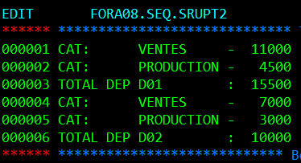
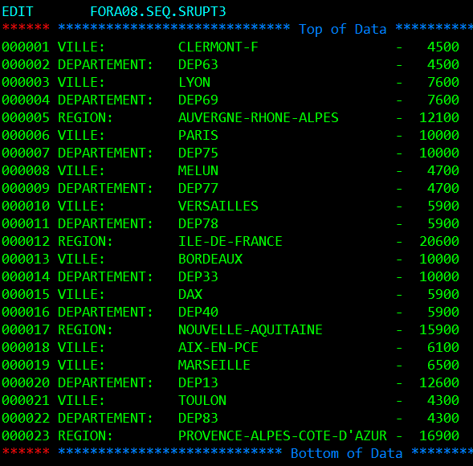
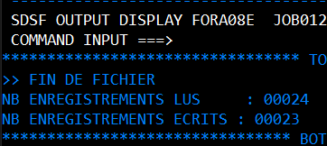

## TP1 - RUPTURE

```cobol
       IDENTIFICATION DIVISION.
       PROGRAM-ID. A08MPGMB.
       AUTHOR. ALEXANDRE.

       ENVIRONMENT DIVISION.
       CONFIGURATION SECTION.
       SPECIAL-NAMES.
           DECIMAL-POINT IS COMMA.

       INPUT-OUTPUT SECTION.
       FILE-CONTROL.
           SELECT FEMPLOYES ASSIGN TO DDENTREE
               FILE STATUS IS CR-EMP.

       DATA DIVISION.

       FILE SECTION.
       FD FEMPLOYES
           RECORDING MODE IS F
           DATA RECORD IS ENR-EMP.

       01 ENR-EMP.
           05 DEP-NUM         PIC X(3).
           05 FILLER          PIC X(2).
           05 NOM-PRENOM      PIC X(13).
           05 FILLER          PIC X(2).
           05 SALAIRE         PIC 9(5).
           05 FILLER          PIC X(55).

       WORKING-STORAGE SECTION.
       01 CR-EMP               PIC XX.
       01 TOTAL-SALAIRE        PIC 9(6) VALUE ZEROS.
       01 DEP-CURRENT          PIC X(3).
       01 DEP-PREVIOUS         PIC X(3) VALUE SPACES.

       01 TEXTE-TOTAL.
           05 FILLER           PIC X(14) VALUE 'TOTAL DEP '.
           05 TEXTE-DEP        PIC X(3).
           05 FILLER           PIC X(3) VALUE ' : '.
           05 TEXTE-MONTANT    PIC Z(6).

       PROCEDURE DIVISION.

       DEBUT.
           PERFORM INITIALISATION
           PERFORM TRAITEMENT UNTIL CR-EMP = '10'
           PERFORM AFFICHER-DERNIER-TOTAL
           PERFORM FIN
           STOP RUN.

       INITIALISATION.
           OPEN INPUT FEMPLOYES
           IF CR-EMP NOT = '00'
               DISPLAY 'ERREUR OUVERTURE FICHIER : ' CR-EMP
               MOVE '10' TO CR-EMP
           ELSE
               PERFORM LIRE-ENR
           END-IF.

       TRAITEMENT.
           IF CR-EMP = '10'
               EXIT PARAGRAPH
           END-IF

           MOVE DEP-NUM TO DEP-CURRENT

           IF DEP-CURRENT NOT = DEP-PREVIOUS AND DEP-PREVIOUS NOT = SPACES
               PERFORM AFFICHER-TOTAL
               MOVE 0 TO TOTAL-SALAIRE
           END-IF

           ADD SALAIRE TO TOTAL-SALAIRE
           MOVE DEP-CURRENT TO DEP-PREVIOUS

           PERFORM LIRE-ENR.

       LIRE-ENR.
           READ FEMPLOYES
           IF CR-EMP = '10'
               DISPLAY 'FIN DE FICHIER            ' CR-EMP
           ELSE
           IF CR-EMP NOT = '00'
               DISPLAY 'ERREUR LECTURE FICHIER     ' CR-EMP
               MOVE '10' TO CR-EMP
           END-IF
           END-IF.

       AFFICHER-TOTAL.
           MOVE DEP-PREVIOUS TO TEXTE-DEP
           MOVE TOTAL-SALAIRE TO TEXTE-MONTANT
           DISPLAY TEXTE-TOTAL.

       AFFICHER-DERNIER-TOTAL.
           IF DEP-PREVIOUS NOT = SPACES
               PERFORM AFFICHER-TOTAL
           END-IF.

       FIN.
           CLOSE FEMPLOYES
           IF CR-EMP NOT = '00'
               DISPLAY 'ERREUR FERMETURE FICHIER : ' CR-EMP
           END-IF.
```

### EXECUTION DU PROGRAMME 
```JCL
//FORA08E JOB ACCTFORA,'FORA08',CLASS=A,MSGCLASS=A,NOTIFY=&SYSUID,
//        TIME=(,1)                                               
//*--------------------------------------------------------------*
//*---      EXECUTION DE PROGRAMME BATCH                      ---*
//*--------------------------------------------------------------*
//JOBLIB DD DSN=FORA99.LIB.LOAD,DISP=SHR                          
//STEP1   EXEC PGM=A08EPGMB                                       
//SYSOUT DD SYSOUT=*                                              
//SYSPRINT DD SYSOUT=*                                            
//DDENTREE  DD DSN=FORA08.SEQ.RUPTURE1,DISP=SHR                    
```


## TP1 - RUPTURE AVEC FICHIER DE SORTIE

```cobol
       IDENTIFICATION DIVISION.               
       PROGRAM-ID. A08IPGMB.                  
       AUTHOR. ALEXANDRE.                     
                                              
       ENVIRONMENT DIVISION.                  
       CONFIGURATION SECTION.                 
                                              
       INPUT-OUTPUT SECTION.                  
       FILE-CONTROL.                          
           SELECT FEMPLOYES ASSIGN TO DDENTREE
               FILE STATUS IS CR-EMP.         
           SELECT FSORTIE ASSIGN TO DDSORTIE. 
                                              
       DATA DIVISION.                         
       FILE SECTION.                          
       FD FEMPLOYES                           
           RECORDING MODE IS F                
           DATA RECORD IS ENR-EMP.            
                                              
       01 ENR-EMP.                            
          05 DEP-NUM         PIC X(3).        
          05 FILLER          PIC X(2).        
          05 NOM-PRENOM      PIC X(13).       
          05 FILLER          PIC X(2).        
          05 SALAIRE         PIC 9(4).        
          05 FILLER          PIC X(56).       
                                              
       FD FSORTIE                             
           RECORDING MODE IS F                
           DATA RECORD IS SOR-EMP.            
                                              
       01 SOR-EMP.                            
          05 FILLER-TOTAL     PIC X(10).      
          05 TEXTE-DEP        PIC X(3).       
          05 FILLER-SEP       PIC X(3).       
          05 TEXTE-MONTANT    PIC Z(5)9.
          05 FILLER-TOTO      PIC X(58).                   
                                                           
       WORKING-STORAGE SECTION.                            
       77 FILLER-SPACES        PIC X(58) VALUE SPACES.
       01 CR-EMP               PIC XX.                     
       01 TOTAL-SALAIRE        PIC 9(6) VALUE ZEROS.       
       01 DEP-CURRENT          PIC X(3).                   
       01 DEP-PREVIOUS         PIC X(3) VALUE SPACES.      
                                                           
       PROCEDURE DIVISION.                                 
       DEBUT.                                              
           PERFORM INITIALISATION                          
           PERFORM TRAITEMENT UNTIL CR-EMP = '10'          
           PERFORM AFFICHER-DERNIER-TOTAL                  
           PERFORM FIN                                     
           STOP RUN.                                       
                                                           
       INITIALISATION.                                     
           OPEN INPUT FEMPLOYES                            
           OPEN OUTPUT FSORTIE                             
                                                           
           IF CR-EMP NOT = '00'                            
               DISPLAY 'ERREUR OUVERTURE FICHIER : ' CR-EMP
               MOVE '10' TO CR-EMP                         
           ELSE                                            
               PERFORM LIRE-ENR                            
           END-IF.                                         
                                                           
       TRAITEMENT.                                         
           IF CR-EMP = '10'                                
               EXIT PARAGRAPH                              
           END-IF                                          
                                                           
           MOVE DEP-NUM TO DEP-CURRENT                     

           IF DEP-CURRENT NOT = DEP-PREVIOUS               
               AND DEP-PREVIOUS NOT = SPACES               
               PERFORM AFFICHER-TOTAL                      
               MOVE 0 TO TOTAL-SALAIRE                     
           END-IF                                          
                                                           
           ADD SALAIRE TO TOTAL-SALAIRE                    
           MOVE DEP-CURRENT TO DEP-PREVIOUS                
           PERFORM LIRE-ENR.                               
                                                           
       LIRE-ENR.                                           
           READ FEMPLOYES                                  
           IF CR-EMP = '10'                                
               DISPLAY 'FIN DE FICHIER            ' CR-EMP 
           ELSE                                            
           IF CR-EMP NOT = '00'                            
               DISPLAY 'ERREUR LECTURE FICHIER     ' CR-EMP
               MOVE '10' TO CR-EMP                         
           END-IF                                          
           END-IF.                                         
                                                           
       AFFICHER-TOTAL.                                     
           MOVE 'TOTAL DEP ' TO FILLER-TOTAL               
           MOVE DEP-PREVIOUS TO TEXTE-DEP                  
           MOVE TOTAL-SALAIRE TO TEXTE-MONTANT             
           MOVE ' : ' TO FILLER-SEP
           MOVE FILLER-SPACES TO FILLER-TOTO             
           WRITE SOR-EMP.                                  
                                                           
       AFFICHER-DERNIER-TOTAL.                             
           IF DEP-PREVIOUS NOT = SPACES                    
               PERFORM AFFICHER-TOTAL                      
           END-IF.                                         
                                                           
       FIN.                                                
           CLOSE FEMPLOYES
           CLOSE FSORTIE.                               
```

### EXECUTION DU PROGRAMME 
```JCL
//FORA08E JOB ACCTFORA,'FORA08',CLASS=A,MSGCLASS=A,NOTIFY=&SYSUID,
//        TIME=(,1)                                               
//*--------------------------------------------------------------*
//*---      EXECUTION DE PROGRAMME BATCH                      ---*
//*--------------------------------------------------------------*
//JOBLIB DD DSN=FORA99.LIB.LOAD,DISP=SHR                          
//STEP1   EXEC PGM=A08EPGMB                                       
//SYSOUT DD SYSOUT=*                                              
//SYSPRINT DD SYSOUT=*                                            
//DDENTREE  DD DSN=FORA08.SEQ.RUPTURE1,DISP=SHR
//DDSORTIE DD DSN=FORA08.SEQ.SRUPTURE,                      
//            DISP=(NEW,CATLG,DELETE),                      
//            SPACE=(TRK,(1,1),RLSE),                       
//            DCB=(RECFM=FB,LRECL=80,BLKSIZE=23200,DSORG=PS)                  
```

## TP 2 - RUPTURE A 2 NIVEAUX

```COBOL
       IDENTIFICATION DIVISION.               
       PROGRAM-ID. A08JPGMB.                 
       AUTHOR. ALEXANDRE.                    

       ENVIRONMENT DIVISION.                 
       INPUT-OUTPUT SECTION.                 
       FILE-CONTROL.                         
           SELECT FEMPLOYES ASSIGN TO DDENTREE
               FILE STATUS IS CR-EMP.         
           SELECT FSORTIE ASSIGN TO DDSORTIE. 

       DATA DIVISION.                         
       FILE SECTION.                          
       FD FEMPLOYES                            
           RECORDING MODE IS F                
           DATA RECORD IS ENR-EMP.            

       01 ENR-EMP.                             
          05 DEP-NUM         PIC X(3).        
          05 FILLER          PIC X(2).        
          05 CAT-NAME        PIC X(10).
          05 FILLER          PIC X(2).        
          05 NOM-PRENOM      PIC X(13).       
          05 FILLER          PIC X(2).        
          05 SALAIRE         PIC 9(4).        
          05 FILLER          PIC X(44).       

       FD FSORTIE                              
           RECORDING MODE IS F                 
           DATA RECORD IS SOR-EMP.             

       01 SOR-EMP.                             
          05 FILLER-TEXT      PIC X(10).      
          05 TEXTE-CLE        PIC X(10).      
          05 FILLER-SEP       PIC X(3).       
          05 TEXTE-MONTANT    PIC Z(5)9.      
          05 FILLER-TOTO      PIC X(57).      

       WORKING-STORAGE SECTION.                             
       77 FILLER-SPACES        PIC X(57) VALUE SPACES.
       01 CR-EMP               PIC XX.                      
       01 TOTAL-SALAIRE-CAT    PIC 9(6) VALUE ZEROS.       
       01 TOTAL-SALAIRE-DEP    PIC 9(6) VALUE ZEROS.       
       01 DEP-CURRENT          PIC X(3).                  
       01 DEP-PREVIOUS         PIC X(3) VALUE SPACES.      
       01 CAT-CURRENT          PIC X(10).                 
       01 CAT-PREVIOUS         PIC X(10) VALUE SPACES.     

       PROCEDURE DIVISION.                                 
       DEBUT.                                              
           PERFORM INITIALISATION                           
           PERFORM TRAITEMENT UNTIL CR-EMP = '10'           
           PERFORM AFFICHER-DERNIER-TOTAL                  
           PERFORM FIN                                      
           STOP RUN.                                        

       INITIALISATION.                                      
           OPEN INPUT FEMPLOYES                             
           OPEN OUTPUT FSORTIE                              
           IF CR-EMP NOT = '00'                             
               DISPLAY 'ERREUR OUVERTURE FICHIER : ' CR-EMP 
               MOVE '10' TO CR-EMP                          
           ELSE                                             
               PERFORM LIRE-ENR                             
           END-IF.                                          

       TRAITEMENT.                                                                               
           MOVE DEP-NUM TO DEP-CURRENT                      
           MOVE CAT-NAME TO CAT-CURRENT                     

           IF DEP-CURRENT NOT = DEP-PREVIOUS                
               AND DEP-PREVIOUS NOT = SPACES                
               PERFORM AFFICHER-SOUS-TOTAL-CAT              
               PERFORM AFFICHER-TOTAL-DEP                   
               MOVE 0 TO TOTAL-SALAIRE-DEP                  
               MOVE 0 TO TOTAL-SALAIRE-CAT                  
           ELSE                                             
               IF CAT-CURRENT NOT = CAT-PREVIOUS
                   AND CAT-PREVIOUS NOT = SPACES            
                   PERFORM AFFICHER-SOUS-TOTAL-CAT          
                   MOVE 0 TO TOTAL-SALAIRE-CAT              
               END-IF                                       
           END-IF                                           

           ADD SALAIRE TO TOTAL-SALAIRE-CAT                 
           ADD SALAIRE TO TOTAL-SALAIRE-DEP                 
           MOVE DEP-CURRENT TO DEP-PREVIOUS                 
           MOVE CAT-CURRENT TO CAT-PREVIOUS                 
           PERFORM LIRE-ENR.                                

       LIRE-ENR.                                            
           READ FEMPLOYES                                   
           IF CR-EMP = '10'                                 
               DISPLAY 'FIN DE FICHIER'                     
           ELSE                                             
               IF CR-EMP NOT = '00'                         
                   DISPLAY 'ERREUR LECTURE FICHIER' CR-EMP  
                   MOVE '10' TO CR-EMP                      
               END-IF                                       
           END-IF.                                          

       AFFICHER-SOUS-TOTAL-CAT.                             
           MOVE 'CAT: ' TO FILLER-TEXT                      
           MOVE CAT-PREVIOUS TO TEXTE-CLE                   
           MOVE ' - ' TO FILLER-SEP                         
           MOVE TOTAL-SALAIRE-CAT TO TEXTE-MONTANT          
           MOVE FILLER-SPACES TO FILLER-TOTO                
           WRITE SOR-EMP.                                   

       AFFICHER-TOTAL-DEP.                                  
           MOVE 'TOTAL DEP' TO FILLER-TEXT                  
           MOVE DEP-PREVIOUS TO TEXTE-CLE                   
           MOVE ' : ' TO FILLER-SEP                         
           MOVE TOTAL-SALAIRE-DEP TO TEXTE-MONTANT          
           MOVE FILLER-SPACES TO FILLER-TOTO                
           WRITE SOR-EMP.                                   

       AFFICHER-DERNIER-TOTAL.                             
           IF DEP-PREVIOUS NOT = SPACES                     
               PERFORM AFFICHER-SOUS-TOTAL-CAT              
               PERFORM AFFICHER-TOTAL-DEP                   
           END-IF.                                          

       FIN.                                                 
           CLOSE FEMPLOYES                                  
           CLOSE FSORTIE.
```

### EXECUTION DU PROGRAMME 
```JCL
//FORA08E JOB ACCTFORA,'FORA08',CLASS=A,MSGCLASS=A,NOTIFY=&SYSUID,
//        TIME=(,1)                                               
//*--------------------------------------------------------------*
//*---      EXECUTION DE PROGRAMME BATCH                      ---*
//*--------------------------------------------------------------*
//JOBLIB DD DSN=FORA99.LIB.LOAD,DISP=SHR                          
//STEP1   EXEC PGM=A08JPGMB                                       
//SYSOUT DD SYSOUT=*                                              
//SYSPRINT DD SYSOUT=*                                            
//DDENTREE  DD DSN=FORA08.SEQ.RUPTURE2,DISP=SHR
//DDSORTIE DD DSN=FORA08.SEQ.SRUPT2,                      
//            DISP=(NEW,CATLG,DELETE),                      
//            SPACE=(TRK,(1,1),RLSE),                       
//            DCB=(RECFM=FB,LRECL=80,BLKSIZE=23200,DSORG=PS)                  
```


## TP 2 - gestion de l'affichage des codes erreurs centraliser.

```cobol
       IDENTIFICATION DIVISION.
       PROGRAM-ID. A08KPGMB.
       AUTHOR. ALEXANDRE.

       ENVIRONMENT DIVISION.
       INPUT-OUTPUT SECTION.
       FILE-CONTROL.
           SELECT FEMPLOYES ASSIGN TO DDENTREE
               FILE STATUS IS CR-EMP.
           SELECT FSORTIE ASSIGN TO DDSORTIE.

       DATA DIVISION.
       FILE SECTION.

       FD FEMPLOYES
           RECORDING MODE IS F
           DATA RECORD IS ENR-EMP.
       01 ENR-EMP.
          05 DEP-NUM         PIC X(3).
          05 FILLER          PIC X(2).
          05 CAT-NOM         PIC X(10).
          05 FILLER          PIC X(2).
          05 NOM-PRENOM      PIC X(13).
          05 FILLER          PIC X(2).
          05 SALAIRE         PIC 9(4).
          05 FILLER          PIC X(44).

       FD FSORTIE
           RECORDING MODE IS F
           DATA RECORD IS SOR-EMP.
       01 SOR-EMP.
          05 FILLER-TEXT      PIC X(10).
          05 TEXTE-CLE        PIC X(10).
          05 FILLER-SEP       PIC X(3).
          05 TEXTE-MONTANT    PIC Z(5)9.
          05 FILLER-TOTO      PIC X(51).

       WORKING-STORAGE SECTION.
       01 CR-EMP               PIC XX.
       01 TOTAL-SALAIRE-CAT    PIC 9(6) VALUE ZEROS.
       01 TOTAL-SALAIRE-DEP    PIC 9(6) VALUE ZEROS.
       01 DEP-CURRENT          PIC X(3).
       01 CAT-CURRENT          PIC X(10).
       01 DEP-PREVIOUS         PIC X(3) VALUE SPACES.
       01 CAT-PREVIOUS         PIC X(10) VALUE SPACES.
       77 FILLER-SPACES        PIC X(51) VALUE SPACES.
       01 ACTION-COURANTE      PIC X(10) VALUE SPACES.

       PROCEDURE DIVISION.
       DEBUT.
           PERFORM INITIALISATION
           PERFORM TRAITEMENT UNTIL CR-EMP = '10'
           PERFORM AFFICHER-DERNIERS-TOTAUX
           PERFORM FIN
           STOP RUN.

       INITIALISATION.
           MOVE 'OUVERTURE' TO ACTION-COURANTE
           OPEN INPUT FEMPLOYES
           PERFORM AFFICHER-ERREUR

           OPEN OUTPUT FSORTIE
           PERFORM AFFICHER-ERREUR

           MOVE 'LECTURE' TO ACTION-COURANTE
           PERFORM LIRE-ENR
           PERFORM AFFICHER-ERREUR.

       TRAITEMENT.
           MOVE DEP-NUM TO DEP-CURRENT
           MOVE CAT-NOM TO CAT-CURRENT

           IF DEP-CURRENT NOT = DEP-PREVIOUS
               AND DEP-PREVIOUS NOT = SPACES
               PERFORM AFFICHER-SOUS-TOTAL-CAT
               PERFORM AFFICHER-TOTAL-DEP
               MOVE 0 TO TOTAL-SALAIRE-DEP
               MOVE 0 TO TOTAL-SALAIRE-CAT
           ELSE
               IF CAT-CURRENT NOT = CAT-PREVIOUS
                   PERFORM AFFICHER-SOUS-TOTAL-CAT
                   MOVE 0 TO TOTAL-SALAIRE-CAT
               END-IF
           END-IF

           ADD SALAIRE TO TOTAL-SALAIRE-CAT
           ADD SALAIRE TO TOTAL-SALAIRE-DEP

           MOVE DEP-CURRENT TO DEP-PREVIOUS
           MOVE CAT-CURRENT TO CAT-PREVIOUS

           MOVE 'LECTURE' TO ACTION-COURANTE
           PERFORM LIRE-ENR
           PERFORM AFFICHER-ERREUR.

       LIRE-ENR.
           READ FEMPLOYES
           IF CR-EMP NOT = '00' AND CR-EMP NOT = '10'
               MOVE '10' TO CR-EMP
           END-IF.

       AFFICHER-SOUS-TOTAL-CAT.
           IF CAT-PREVIOUS NOT = SPACES
               MOVE 'CAT: ' TO FILLER-TEXT
               MOVE CAT-PREVIOUS TO TEXTE-CLE
               MOVE ' - ' TO FILLER-SEP
               MOVE TOTAL-SALAIRE-CAT TO TEXTE-MONTANT
               MOVE FILLER-SPACES TO FILLER-TOTO
               MOVE 'ECRITURE' TO ACTION-COURANTE
               WRITE SOR-EMP
               PERFORM AFFICHER-ERREUR
           END-IF.

       AFFICHER-TOTAL-DEP.
           MOVE 'TOTAL DEP ' TO FILLER-TEXT
           MOVE DEP-PREVIOUS TO TEXTE-CLE
           MOVE ' : ' TO FILLER-SEP
           MOVE TOTAL-SALAIRE-DEP TO TEXTE-MONTANT
           MOVE FILLER-SPACES TO FILLER-TOTO
           MOVE 'ECRITURE' TO ACTION-COURANTE
           WRITE SOR-EMP
           PERFORM AFFICHER-ERREUR.

       AFFICHER-DERNIERS-TOTAUX.
           IF DEP-PREVIOUS NOT = SPACES
               PERFORM AFFICHER-SOUS-TOTAL-CAT
               PERFORM AFFICHER-TOTAL-DEP
           END-IF.

       AFFICHER-ERREUR.
           EVALUATE CR-EMP                                           
               WHEN '00'                                             
                   CONTINUE                                          
               WHEN '35'                                             
                   DISPLAY '>> ERREUR 35 : FICHIER INTROUVABLE'      
                            ' PENDANT ' ACTION-COURANTE              
      *            MOVE '10' TO CR-EMP                               
               WHEN '39'                                             
                   DISPLAY '>> ERREUR 39 : FORMAT DE FICHIER'        
                            ' INVALIDE LORS DE ' ACTION-COURANTE     
      *            MOVE '10' TO CR-EMP                               
               WHEN '91'                                             
                   DISPLAY '>> ERREUR 91 : FICHIER NON OUVERT AVANT '
                            ACTION-COURANTE                          
      *            MOVE '10' TO CR-EMP                               
               WHEN '93'                                             
                   DISPLAY '>> ERREUR 93 : FICHIER OUVERT EN MODE'   
                            ' INCORRECT POUR ' ACTION-COURANTE       
      *            MOVE '10' TO CR-EMP                               
               WHEN OTHER                                            
                   DISPLAY '>> ERREUR ' CR-EMP ' DURANT '            
                            ACTION-COURANTE                          
      *            MOVE '10' TO CR-EMP                               
           END-EVALUATE.                                             

       FIN.
           MOVE 'FERMETURE' TO ACTION-COURANTE
           CLOSE FEMPLOYES
           PERFORM AFFICHER-ERREUR

           CLOSE FSORTIE
           PERFORM AFFICHER-ERREUR.
```

## Transférer un fichier COBOL vers le mainframe avec IND$FILE
### 1. Préparer le fichier COBOL sur ton PC
```
C:\Users\Alexa\Documents\Dossier Aubay\Formation\COBOL\A08KPGMB.cob
```

### 2. Créer ou connaître le nom du dataset cible sur le mainframe
```
FORA08.LIB.SOURCE(A08KPGMB)
```

### 3. Ouvrir une session TSO dans wc3270 et taper :
```
TSO RECEIVE
```
### Depuis wc3270, lancer le transfert du fichier local

Clique droit dans wc3270 > File Transfer...  
(sinon tu peux taper Alt+T ou passer par le menu Actions > File Transfer)  

#### Dans la fenêtre qui s’ouvre :  

Champ | Valeur
------|---------
Host File | "'TONUSER.COBOL.TEST(PROGRAM1)'" (avec guillemets doubles !)
Local File | Chemin vers ton fichier, ex : C:\Users\...\prog.cob
Direction | Send (vers le mainframe)
Host File Type | RECORD
CRLF | Coché
Append | Décoché
Host Code Page | IBM-037 (ou laisse par défaut)

## TP 4 -  RUPTURE A 3 NIVEAUX


```cobol
       IDENTIFICATION DIVISION.
       PROGRAM-ID. A08LPGMB.
       AUTHOR. ALEXANDRE.

       ENVIRONMENT DIVISION.
       INPUT-OUTPUT SECTION.
       FILE-CONTROL.
           SELECT FENTREE ASSIGN TO DDENTREE
               FILE STATUS IS CR-EMP.
           SELECT FSORTIE ASSIGN TO DDSORTIE.

       DATA DIVISION.
       FILE SECTION.

       FD FENTREE
           RECORDING MODE IS F
           DATA RECORD IS ENR-ENT.
       01 ENR-ENT.
          05 REGION         PIC X(26).          
          05 FILLER         PIC X.
          05 DEP-NUM        PIC X(5).    
          05 FILLER         PIC X.
          05 VILLE-NOM      PIC X(10).       
          05 FILLER         PIC X.
          05 NOM-PRENOM     PIC X(18).      
          05 FILLER         PIC X.
          05 SALAIRE        PIC Z(5)9.       
          05 FILLER         PIC X(12).
          
       FD FSORTIE
           RECORDING MODE IS F
           DATA RECORD IS SOR-REC.
       01 SOR-REC.
          05 LABEL-TEXT      PIC X(15).
          05 NOM-GROUPE      PIC X(26).        
          05 FILLER-SEP      PIC X(3).
          05 MONTANT         PIC Z(5)9.
          05 FILLER-SPC      PIC X(30).

       WORKING-STORAGE SECTION.
       01 FILLER-SPACES      PIC X(30) VALUE SPACES.
       01 CR-EMP             PIC XX.
       01 TOTAL-REGION       PIC 9(6) VALUE ZERO.
       01 TOTAL-DEPT         PIC 9(6) VALUE ZERO.
       01 TOTAL-VILLE        PIC 9(6) VALUE ZERO.

       01 REG-CURR           PIC X(26).         
       01 DEP-CURR           PIC X(5).           
       01 VIL-CURR           PIC X(10).               
       01 SALAIRE-CURR       PIC 9(5).           

       01 REG-PREV           PIC X(26) VALUE SPACES.   
       01 DEP-PREV           PIC X(5) VALUE SPACES.    
       01 VIL-PREV           PIC X(10) VALUE SPACES.   

       01 NB-LUS             PIC 9(5) VALUE ZERO.
       01 NB-ECRITS          PIC 9(5) VALUE ZERO.
       01 ACTION-COURANTE    PIC X(10) VALUE SPACES.

       PROCEDURE DIVISION.
       0000-MAIN.
           PERFORM 1000-INITIALISATION
           PERFORM 2000-TRAITEMENT UNTIL CR-EMP = '10'
           PERFORM 3000-AFFICHER-DERNIERS-TOTAUX
           PERFORM 4000-FINALISATION
           STOP RUN.

       1000-INITIALISATION.
           MOVE 'OUVERTURE' TO ACTION-COURANTE
           OPEN INPUT FENTREE
           PERFORM 2500-AFFICHER-ERREUR

           OPEN OUTPUT FSORTIE
           PERFORM 2500-AFFICHER-ERREUR

           MOVE 'LECTURE' TO ACTION-COURANTE
           PERFORM 2100-LIRE-ENR.

       2000-TRAITEMENT.
           ADD 1 TO NB-LUS

           MOVE REGION TO REG-CURR
           MOVE DEP-NUM TO DEP-CURR
           MOVE VILLE-NOM TO VIL-CURR
           MOVE SALAIRE TO SALAIRE-CURR

           IF REG-CURR NOT = REG-PREV AND REG-PREV NOT = SPACES
               PERFORM 2200-AFFICHER-SOUS-TOTAL-VILLE
               PERFORM 2300-AFFICHER-SOUS-TOTAL-DEPT
               PERFORM 2400-AFFICHER-TOTAL-REGION
               MOVE 0 TO TOTAL-REGION TOTAL-DEPT TOTAL-VILLE
           ELSE
               IF DEP-CURR NOT = DEP-PREV
                   PERFORM 2200-AFFICHER-SOUS-TOTAL-VILLE
                   PERFORM 2300-AFFICHER-SOUS-TOTAL-DEPT
                   MOVE 0 TO TOTAL-DEPT TOTAL-VILLE
               ELSE
                   IF VIL-CURR NOT = VIL-PREV
                       PERFORM 2200-AFFICHER-SOUS-TOTAL-VILLE
                       MOVE 0 TO TOTAL-VILLE
                   END-IF
               END-IF
           END-IF

           ADD SALAIRE TO TOTAL-VILLE
           ADD SALAIRE TO TOTAL-DEPT
           ADD SALAIRE TO TOTAL-REGION

           MOVE REG-CURR TO REG-PREV
           MOVE DEP-CURR TO DEP-PREV
           MOVE VIL-CURR TO VIL-PREV

           PERFORM 2100-LIRE-ENR.

       2100-LIRE-ENR.
           READ FENTREE
           IF CR-EMP = '10'
               DISPLAY 'FIN DE FICHIER'
           else
               PERFORM 2500-AFFICHER-ERREUR    
           END-IF.

       2200-AFFICHER-SOUS-TOTAL-VILLE.
           IF VIL-PREV NOT = SPACES
               MOVE 'VILLE:' TO LABEL-TEXT
               MOVE VIL-PREV TO NOM-GROUPE
               MOVE ' - ' TO FILLER-SEP
               MOVE TOTAL-VILLE TO MONTANT
               MOVE FILLER-SPACES TO FILLER-SPC
               WRITE SOR-REC
               ADD 1 TO NB-ECRITS
           END-IF.

       2300-AFFICHER-SOUS-TOTAL-DEPT.
           IF DEP-PREV NOT = SPACES
               MOVE 'DEPARTEMENT:' TO LABEL-TEXT
               MOVE DEP-PREV TO NOM-GROUPE
               MOVE ' - ' TO FILLER-SEP
               MOVE TOTAL-DEPT TO MONTANT
               MOVE FILLER-SPACES TO FILLER-SPC
               WRITE SOR-REC
               ADD 1 TO NB-ECRITS
           END-IF.

       2400-AFFICHER-TOTAL-REGION.
           IF REG-PREV NOT = SPACES
               MOVE 'REGION:' TO LABEL-TEXT
               MOVE REG-PREV TO NOM-GROUPE
               MOVE ' - ' TO FILLER-SEP
               MOVE TOTAL-REGION TO MONTANT
               MOVE FILLER-SPACES TO FILLER-SPC
               WRITE SOR-REC
               ADD 1 TO NB-ECRITS
           END-IF.

       2500-AFFICHER-ERREUR.
           EVALUATE CR-EMP                                           
               WHEN '00'                                             
                   CONTINUE                                          
               WHEN '35'                                             
                   DISPLAY '>> ERREUR 35 : FICHIER INTROUVABLE'      
                            ' PENDANT ' ACTION-COURANTE              
      *            MOVE '10' TO CR-EMP                               
               WHEN '39'                                             
                   DISPLAY '>> ERREUR 39 : FORMAT DE FICHIER'        
                            ' INVALIDE LORS DE ' ACTION-COURANTE     
      *            MOVE '10' TO CR-EMP                               
               WHEN '91'                                             
                   DISPLAY '>> ERREUR 91 : FICHIER NON OUVERT AVANT '
                            ACTION-COURANTE                          
      *            MOVE '10' TO CR-EMP                               
               WHEN '93'                                             
                   DISPLAY '>> ERREUR 93 : FICHIER OUVERT EN MODE'   
                            ' INCORRECT POUR ' ACTION-COURANTE       
      *            MOVE '10' TO CR-EMP                               
               WHEN OTHER                                            
                   DISPLAY '>> ERREUR ' CR-EMP ' DURANT '            
                            ACTION-COURANTE                          
      *            MOVE '10' TO CR-EMP                               
           END-EVALUATE.                                             
 
       3000-AFFICHER-DERNIERS-TOTAUX. 
           PERFORM 2200-AFFICHER-SOUS-TOTAL-VILLE
           PERFORM 2300-AFFICHER-SOUS-TOTAL-DEPT
           PERFORM 2400-AFFICHER-TOTAL-REGION.
            

       4000-FINALISATION.
           DISPLAY 'NB ENREGISTREMENTS LUS     : ' NB-LUS
           DISPLAY 'NB ENREGISTREMENTS ECRITS : ' NB-ECRITS
           
           MOVE 'FERMETURE' TO ACTION-COURANTE
           CLOSE FENTREE
           PERFORM 2500-AFFICHER-ERREUR

           CLOSE FSORTIE.
           PERFORM 2500-AFFICHER-ERREUR
```
### FICHIER ENTRER 
```
AUVERGNE-RHONE-ALPES      ,DEP63,CLERMONT-F,Sophie Thomas     ,2200
AUVERGNE-RHONE-ALPES      ,DEP63,CLERMONT-F,Bernard Lefevre   ,2300
AUVERGNE-RHONE-ALPES      ,DEP69,LYON      ,Marie Lefevre     ,2400
AUVERGNE-RHONE-ALPES      ,DEP69,LYON      ,Alice Bernard     ,2500
AUVERGNE-RHONE-ALPES      ,DEP69,LYON      ,Jean Dupont       ,2700
ILE-DE-FRANCE             ,DEP75,PARIS     ,Jean Dupont       ,2500
ILE-DE-FRANCE             ,DEP75,PARIS     ,Marie Lefevre     ,2700
ILE-DE-FRANCE             ,DEP75,PARIS     ,Marc Dupuis       ,2200
ILE-DE-FRANCE             ,DEP75,PARIS     ,Claire Martin     ,2600
ILE-DE-FRANCE             ,DEP77,MELUN     ,Bernard Lefevre   ,2400
ILE-DE-FRANCE             ,DEP77,MELUN     ,Jacques Lefevre   ,2300
ILE-DE-FRANCE             ,DEP78,VERSAILLES,Paul Durand       ,2800
ILE-DE-FRANCE             ,DEP78,VERSAILLES,Alice Bernard     ,3100
NOUVELLE-AQUITAINE        ,DEP33,BORDEAUX  ,Jean-Marie Leroy  ,3500
NOUVELLE-AQUITAINE        ,DEP33,BORDEAUX  ,Georges Blanc     ,2900
NOUVELLE-AQUITAINE        ,DEP33,BORDEAUX  ,Sylvie Legrand    ,3600
NOUVELLE-AQUITAINE        ,DEP40,DAX       ,Lucien Leclerc    ,2800
NOUVELLE-AQUITAINE        ,DEP40,DAX       ,Michel Thomas     ,3100
PROVENCE-ALPES-COTE-D'AZUR,DEP13,AIX-EN-PCE,Paul Durand       ,3000
PROVENCE-ALPES-COTE-D'AZUR,DEP13,AIX-EN-PCE,Alice Bernard     ,3100
PROVENCE-ALPES-COTE-D'AZUR,DEP13,MARSEILLE ,Jacques Valls     ,3200
PROVENCE-ALPES-COTE-D'AZUR,DEP13,MARSEILLE ,Sophie Thomas     ,3300
PROVENCE-ALPES-COTE-D'AZUR,DEP83,TOULON    ,Pierre Leroux     ,2100
PROVENCE-ALPES-COTE-D'AZUR,DEP83,TOULON    ,Emma Martin       ,2200
```

### EXECUTION DU PROGRAMME 
```JCL
//FORA08E JOB ACCTFORA,'FORA08',CLASS=A,MSGCLASS=A,NOTIFY=&SYSUID,
//        TIME=(,1)                                               
//*--------------------------------------------------------------*
//*---      EXECUTION DE PROGRAMME BATCH                      ---*
//*--------------------------------------------------------------*
//JOBLIB DD DSN=FORA99.LIB.LOAD,DISP=SHR                          
//STEP1   EXEC PGM=A08LPGMB                                       
//SYSOUT DD SYSOUT=*                                              
//SYSPRINT DD SYSOUT=*                                            
//DDENTREE  DD DSN=FORA08.SEQ.RUPTURE3,DISP=SHR
//DDSORTIE DD DSN=FORA08.SEQ.SRUPT3,                      
//            DISP=(NEW,CATLG,DELETE),                      
//            SPACE=(TRK,(1,1),RLSE),                       
//            DCB=(RECFM=FB,LRECL=80,BLKSIZE=23200,DSORG=PS)                  
```

  

