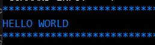
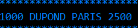
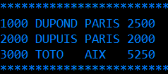
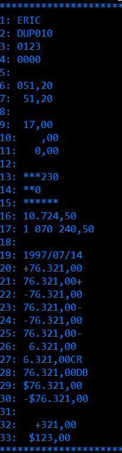
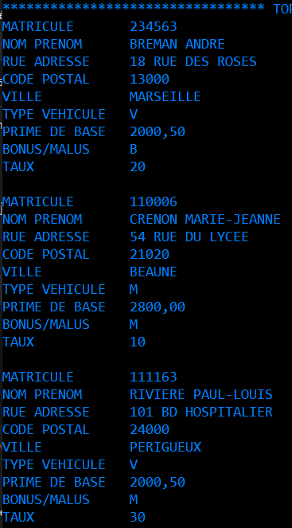

## HELLO WORLD

```COBOL
       IDENTIFICATION DIVISION.
       PROGRAM-ID. A08APGMB.
       AUTHOR. ALEXANDRE.
       ENVIRONMENT DIVISION.
       DATA DIVISION.
       PROCEDURE DIVISION.
           DISPLAY 'HELLO WORLD'
           STOP RUN.
```
```
HILIGHT COBOL
```
### NOM DE PROGRAMME A UTILISER CORRESPONDENT AU REGLE DEFINIE
```
A08APGMB
```
### NOM DU COMPILATEUR
```
ACOBBTCH
```

### REMPLACEMENT D'UN MOT DANS TOUT UN FICHIER VIA COMMANDE 
```
C FORMB FORA08 all
```

### LIB D'EXECUTION DE PROGRAMME JCL
```
FORA99.LIB.LOAD
```

## COMPILATION DU PROGRAMME BATCH
```JCL
//FORA08C JOB ACCTFORA,'FORA08',CLASS=A,MSGCLASS=A,NOTIFY=&SYSUID
//*--------------------------------------------------------------*
//*---     PROCEDURE DE COMPILATION DES PROGRAMMES BATCH      ---*
//*--------------------------------------------------------------*
//COBBTCH EXEC ACOBBTCH,PGMB=A08APGMB
//SYSLINKDDDSN=FORA99.LIB.LOAD,DISP=SHR
//SYSLIB  DD DSN=FORA08.LIB.COPY,DISP=SHR
//LKED.SYSIN DD *
  ENTRY A08APGMB
  NAME  A08APGMB(R)
/*
```
## EXECUTION DE PROGRAMME BATCH
```jcl
//FORAXXE JOB ACCTFORA,'FORA00',CLASS=A,MSGCLASS=A,NOTIFY=&SYSUID 
//*--------------------------------------------------------------*
//*---      EXECUTION DE PROGRAMME BATCH                      ---* 
//*--------------------------------------------------------------*
//JOBLIB DD DSN=FORA99.LIB.LOAD,DISP=SHR                          
//STEP1   EXEC PGM=AXXAPGMT                                       
//SYSOUT DD SYSOUT=*                                              
//SYSPRINT DD SYSOUT=*                                            
```



## A08BPGMB

```COBOL
       IDENTIFICATION DIVISION.
       PROGRAM-ID. A08BPGMB.   
       AUTHOR. ALEXANDRE.      
       ENVIRONMENT DIVISION.   
       DATA DIVISION.          
       WORKING-STORAGE SECTION.
       01   CHAMP PIC X(80).   
       PROCEDURE DIVISION.     
           ACCEPT CHAMP        
           DISPLAY CHAMP       
           STOP RUN.           
```

```JCL
//FORA08E JOB ACCTFORA,'FORA08',CLASS=A,MSGCLASS=A,NOTIFY=&SYSUID 
//*--------------------------------------------------------------*
//*---      EXECUTION DE PROGRAMME BATCH                      ---*
//*--------------------------------------------------------------*
//JOBLIB DD DSN=FORA99.LIB.LOAD,DISP=SHR                          
//STEP1   EXEC PGM=A08BPGMB                                       
//SYSIN DD *                                                      
1000 DUPOND PARIS 2500                                            
//SYSOUT DD SYSOUT=*                                              
//SYSPRINT DD SYSOUT=*
```


## A08CPGMB

```COBOL
        IDENTIFICATION DIVISION.                
        PROGRAM-ID. A08CPGMB.                   
        AUTHOR. ALEXANDRE. 

        ENVIRONMENT DIVISION. 

        DATA DIVISION.                          
        WORKING-STORAGE SECTION.                
        01   CHAMP PIC X(80).  

        PROCEDURE DIVISION.                     
        DEBUT.                                  
            ACCEPT CHAMP.                       
        BOUCLE.                                 
            PERFORM LECTURE UNTIL CHAMP(1:4) = '9999'
            STOP RUN.                           
        LECTURE.                                
            DISPLAY CHAMP                       
            ACCEPT CHAMP.                                                                              
```

```JCL
//FORA08E JOB ACCTFORA,'FORA08',CLASS=A,MSGCLASS=A,NOTIFY=&SYSUID,
//        TIME=(,1) 
//*--------------------------------------------------------------*
//*---      EXECUTION DE PROGRAMME BATCH                      ---*
//*--------------------------------------------------------------*
//JOBLIB DD DSN=FORA99.LIB.LOAD,DISP=SHR                          
//STEP1   EXEC PGM=A08BPGMB                                       
//SYSIN DD *                                                      
1000 DUPOND PARIS 2500                                            
2000 DUPUIS PARIS 2000                                            
3000 TOTO   AIX   5250 
9999                                           
//SYSOUT DD SYSOUT=*                                              
//SYSPRINT DD SYSOUT=*                                            
```



## A08DPGMB - PERFORM OUT-OF-LINE

```COBOL
        IDENTIFICATION DIVISION.                
        PROGRAM-ID. A08DPGMB.                   
        AUTHOR. ALEXANDRE. 

        ENVIRONMENT DIVISION. 

        DATA DIVISION.                          
        WORKING-STORAGE SECTION.                
        01   CHAMP PIC X(80).  

        PROCEDURE DIVISION. 
            PERFORM INITIALISATION                              
            PERFORM LECTURE UNTIL CHAMP(1:4) = '9999'
            STOP RUN.    

        INITIALISATION.     
            ACCEPT CHAMP.
        LECTURE.                                
            DISPLAY CHAMP                       
            ACCEPT CHAMP.                                                                              
```

## A08EPGMB - PICTURE

```COBOL
       IDENTIFICATION DIVISION.        
       PROGRAM-ID. A08EPGMB.

       AUTHOR. ALEXANDRE.             

       ENVIRONMENT DIVISION.           
       CONFIGURATION SECTION.          

       SPECIAL-NAMES.                  
           DECIMAL-POINT IS COMMA.     

       DATA DIVISION.                  
       WORKING-STORAGE SECTION.        
       01 LIGNE1     PIC AAAA    VALUE 'ERIC'.
       01 SLIGNE1    PIC AAAA. 
       01 LIGNE2     PIC XXXXXX  VALUE 'DUP010'.
       01 SLIGNE2    PIC XXXXXX.
       01 LIGNE3     PIC 9999    VALUE 0123.
       01 SLIGNE3    PIC 9999.
       01 LIGNE4     PIC 9999    VALUE 0000.
       01 SLIGNE4    PIC 9999.
       01 LIGNE5     PIC 9999    VALUE 0000.
       01 SLIGNE5    PIC ZZZZ. 
       01 LIGNE6     PIC 999V99  VALUE 51,20.
       01 SLIGNE6    PIC 999,99.
       01 LIGNE7     PIC 999V99  VALUE 51,20.
       01 SLIGNE7    PIC Z99,99.
       01 LIGNE8     PIC 999V99  VALUE 0.
       01 SLIGNE8    PIC ZZZ,ZZ.
       01 LIGNE9     PIC 999V99  VALUE 17.
       01 SLIGNE9    PIC ZZZ,ZZ.
       01 LIGNE10    PIC 999V99  VALUE 0.
       01 SLIGNE10   PIC ZZZ,99. 
       01 LIGNE11    PIC 999V99  VALUE 0.
       01 SLIGNE11   PIC ZZ9,99.
       01 LIGNE12    PIC 999V99  VALUE 0.
       01 SLIGNE12   PIC ZZ9,99.
       01 LIGNE13    PIC 9(5)    VALUE 00230.
       01 SLIGNE13   PIC ******.                  
       01 LIGNE14    PIC 9(3)    VALUE 000.       
       01 SLIGNE14   PIC **9.                     
       01 LIGNE15    PIC 999999  VALUE 000000.    
       01 SLIGNE15   PIC ******.                  
       01 LIGNE16    PIC 9(5)V99 VALUE 10724,50.  
       01 SLIGNE16   PIC ZZ.ZZ9,99.               
       01 LIGNE17    PIC 9(7)V99 VALUE 1070240,50.
       01 SLIGNE17   PIC ZBZZZBZZ9,99.            
       01 LIGNE18    PIC 9(4)V99 VALUE 00000.     
       01 SLIGNE18   PIC Z.ZZZ,ZZ.                
       01 LIGNE19    PIC 9(8)    VALUE 19970714.  
       01 SLIGNE19   PIC 9999/99/99.              
                                                  
       01 LIGNE20    PIC S9(5)V99 VALUE +76321.   
       01 SLIGNE20   PIC +ZZ.ZZ9,99.              
       01 LIGNE21    PIC S9(5)V99 VALUE +76321.   
       01 SLIGNE21   PIC ZZ.ZZ9,99+.              
       01 LIGNE22    PIC S9(5)V99 VALUE -76321.   
       01 SLIGNE22   PIC +ZZ.ZZ9,99.              
       01 LIGNE23    PIC S9(5)V99 VALUE -76321.   
       01 SLIGNE23   PIC ZZ.ZZ9,99+.              
       01 LIGNE24    PIC S9(5)V99 VALUE -76321.   
       01 SLIGNE24   PIC -ZZ.ZZ9,99.              
       01 LIGNE25    PIC S9(5)V99 VALUE -76321.   
       01 SLIGNE25   PIC ZZ.ZZ9,99-.              
       01 LIGNE26    PIC S9(5)V99 VALUE +76321.   
       01 SLIGNE26   PIC -Z.ZZ9,99.               
       01 LIGNE27    PIC S9(5)V99 VALUE -76321.   
       01 SLIGNE27   PIC Z.ZZ9,99CR.              
       01 LIGNE28    PIC S9(5)V99 VALUE -76321.   
       01 SLIGNE28   PIC ZZ.ZZ9,99DB.             
       01 LIGNE29    PIC S9(5)V99 VALUE 0076321. 
       01 SLIGNE29   PIC $ZZ.ZZ9,99.             
       01 LIGNE30    PIC S9(5)V99 VALUE -0076321.
       01 SLIGNE30   PIC -$ZZ.ZZ9,99.            
       01 LIGNE31    PIC S9(5)V99 VALUE 00000.   
       01 SLIGNE31   PIC --.---,--.              
       01 LIGNE32    PIC S9(5)V99 VALUE +0000321.
       01 SLIGNE32   PIC ++B++9,99.              
       01 LIGNE33    PIC S9(5)V99 VALUE 00123.   
       01 SLIGNE33   PIC $B$$9,99.                                    
                                       
       PROCEDURE DIVISION.             
       DEBUT.                          
           MOVE LIGNE1 TO SLIGNE1      
           DISPLAY '1: ' SLIGNE1
           MOVE LIGNE2 TO SLIGNE2      
           DISPLAY '2: ' SLIGNE2 
           MOVE LIGNE3 TO SLIGNE3
           DISPLAY '3: ' SLIGNE3
           MOVE LIGNE4 TO SLIGNE4
           DISPLAY '4: ' SLIGNE4
           MOVE LIGNE5 TO SLIGNE5
           DISPLAY '5: ' SLIGNE5
           MOVE LIGNE6 TO SLIGNE6
           DISPLAY '6: ' SLIGNE6
           MOVE LIGNE6 TO SLIGNE7
           DISPLAY '7: ' SLIGNE7
           MOVE LIGNE8 TO SLIGNE8
           DISPLAY '8: ' SLIGNE8
           MOVE LIGNE9 TO SLIGNE9
           DISPLAY '9: ' SLIGNE9
           MOVE LIGNE10 TO SLIGNE10
           DISPLAY '10: ' SLIGNE10
           MOVE LIGNE11 TO SLIGNE11
           DISPLAY '11: ' SLIGNE11
           IF LIGNE12 = 0
               DISPLAY '12: ' SPACE
           ELSE
               MOVE LIGNE12 TO SLIGNE12
               DISPLAY '12: ' SLIGNE12
           END-IF

           MOVE LIGNE13 TO SLIGNE13
           DISPLAY '13: ' SLIGNE13
           MOVE LIGNE14 TO SLIGNE14
           DISPLAY '14: ' SLIGNE14
           MOVE LIGNE15 TO SLIGNE15
           DISPLAY '15: ' SLIGNE15
           MOVE LIGNE16 TO SLIGNE16
           DISPLAY '16: ' SLIGNE16
           MOVE LIGNE17 TO SLIGNE17
           DISPLAY '17: ' SLIGNE17
           MOVE LIGNE18 TO SLIGNE18
           DISPLAY '18: ' SLIGNE18
           MOVE LIGNE19 TO SLIGNE19
           DISPLAY '19: ' SLIGNE19
           MOVE LIGNE20 TO SLIGNE20
           DISPLAY '20: ' SLIGNE20
           MOVE LIGNE21 TO SLIGNE21
           DISPLAY '21: ' SLIGNE21
           MOVE LIGNE22 TO SLIGNE22
           DISPLAY '22: ' SLIGNE22
           MOVE LIGNE23 TO SLIGNE23
           DISPLAY '23: ' SLIGNE23 
           MOVE LIGNE24 TO SLIGNE24
           DISPLAY '24: ' SLIGNE24 
           MOVE LIGNE25 TO SLIGNE25
           DISPLAY '25: ' SLIGNE25 
           MOVE LIGNE26 TO SLIGNE26
           DISPLAY '26: ' SLIGNE26 
           MOVE LIGNE27 TO SLIGNE27
           DISPLAY '27: ' SLIGNE27 
           MOVE LIGNE28 TO SLIGNE28
           DISPLAY '28: ' SLIGNE28 
           MOVE LIGNE29 TO SLIGNE29
           DISPLAY '29: ' SLIGNE29 
           MOVE LIGNE30 TO SLIGNE30
           DISPLAY '30: ' SLIGNE30 
           MOVE LIGNE31 TO SLIGNE31
           DISPLAY '31: ' SLIGNE31 
           MOVE LIGNE32 TO SLIGNE32
           DISPLAY '32: ' SLIGNE32 
           MOVE LIGNE33 TO SLIGNE33
           DISPLAY '33: ' SLIGNE33 
           STOP RUN.                       
```



## A08GPGMB - TP 1


```COBOL
       IDENTIFICATION DIVISION.                
       PROGRAM-ID. A08GPGMB.                   
       AUTHOR. ALEXANDRE.                      
                                               
       ENVIRONMENT DIVISION.                   
       CONFIGURATION SECTION.                  
       SPECIAL-NAMES.                          
           DECIMAL-POINT IS COMMA.             
       INPUT-OUTPUT SECTION.                   
       FILE-CONTROL.                           
           SELECT FASSURES ASSIGN TO DDENTREE. 
                                               
       DATA DIVISION.                          
       FILE SECTION.                           
       FD  FASSURES                            
           RECORDING MODE IS F                 
           DATA RECORD IS ENRASSURES.           
                                               
       01 ENRASSURES.                           
           05 MATRICULE         PIC 9(6).      
           05 NOM-PRENOM        PIC X(20).     
           05 RUE-ADRESSE       PIC X(18).     
           05 CODE-POSTAL       PIC 9(5).      
           05 VILLE             PIC X(12).     
           05 TYPE-VEHICULE     PIC X(1).      
           05 PRIME-DE-BASE     PIC 9(4)V99.   
           05 BONUS-MALUS       PIC X(1).      
           05 TAUX              PIC 9(2).      
           05 FILLER            PIC X(9).      
                                               
                                               
       WORKING-STORAGE SECTION.                
       01 EOF PIC 9 VALUE 0.                   
       01 SPRIME-DE-BASE PIC 9999,99.                             
                                               
       PROCEDURE DIVISION.                     
           OPEN INPUT FASSURES                 
           PERFORM TRAITEMENT UNTIL EOF = 1    
           PERFORM FIN                         
           STOP RUN.                              
                                              
       TRAITEMENT.                            
           READ FASSURES                      
               AT END                                             
                   MOVE 1 TO EOF                                  
               NOT AT END                                         
                   PERFORM AFFICHAGE-ASSURE                       
           END-READ.                                              
                                                                  
       AFFICHAGE-ASSURE.                                          
           DISPLAY 'MATRICULE       : ' MATRICULE                 
           DISPLAY 'NOM PRENOM      : ' NOM-PRENOM                
           DISPLAY 'RUE ADRESSE     : ' RUE-ADRESSE               
           DISPLAY 'CODE POSTAL     : ' CODE-POSTAL               
           DISPLAY 'VILLE           : ' VILLE                     
           DISPLAY 'TYPE VEHICULE   : ' TYPE-VEHICULE 
           MOVE PRIME-DE-BASE TO SPRIME-DE-BASE            
           DISPLAY 'PRIME DE BASE   : ' PRIME-DE-BASE            
           DISPLAY 'BONUS/MALUS     : ' BONUS-MALUS               
           DISPLAY 'TAUX            : ' TAUX                      
           DISPLAY ' '. 
                                                                  
       FIN.                                                       
           CLOSE FASSURES.                                        
```

### EXECUTION DU PROGRAMME 
```JCL
//FORA08E JOB ACCTFORA,'FORA08',CLASS=A,MSGCLASS=A,NOTIFY=&SYSUID,
//        TIME=(,1)                                               
//*--------------------------------------------------------------*
//*---      EXECUTION DE PROGRAMME BATCH                      ---*
//*--------------------------------------------------------------*
//JOBLIB DD DSN=FORA99.LIB.LOAD,DISP=SHR                          
//STEP1   EXEC PGM=A08EPGMB                                       
//SYSOUT DD SYSOUT=*                                              
//SYSPRINT DD SYSOUT=*                                            
//DDENTREE  DD DSN=FORA08.SEQ.ASSURES,DISP=SHR                    
```




