## Création d'un fichier sequential par TSO ISF

### Accès au menu DSUtility avec la commande ``3.2``

Le menu 3.2 est utiliser pour la création de fichier.


### NAME
```
'FORA08.SEQ.ARTICLES'
```
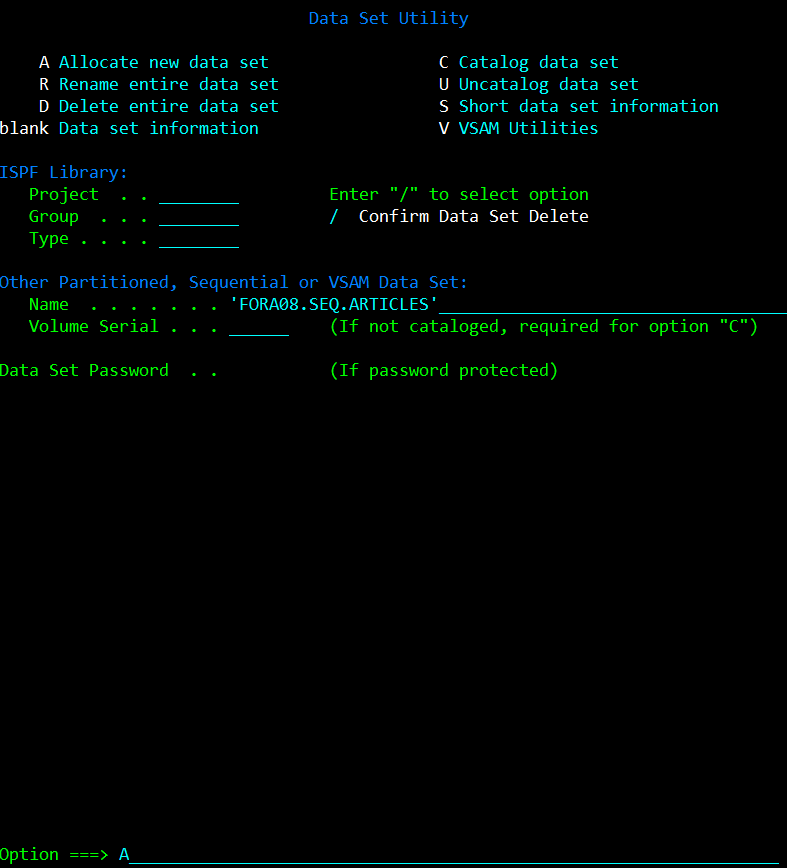

### Paramètres du fichier à créer


### Consultation d'un fichier existant pour garder les paramètres de ce fichier sur mon nouveau fichier.


### Quelque tests pour valider la bonne configuration d'un fichier ``sequential``

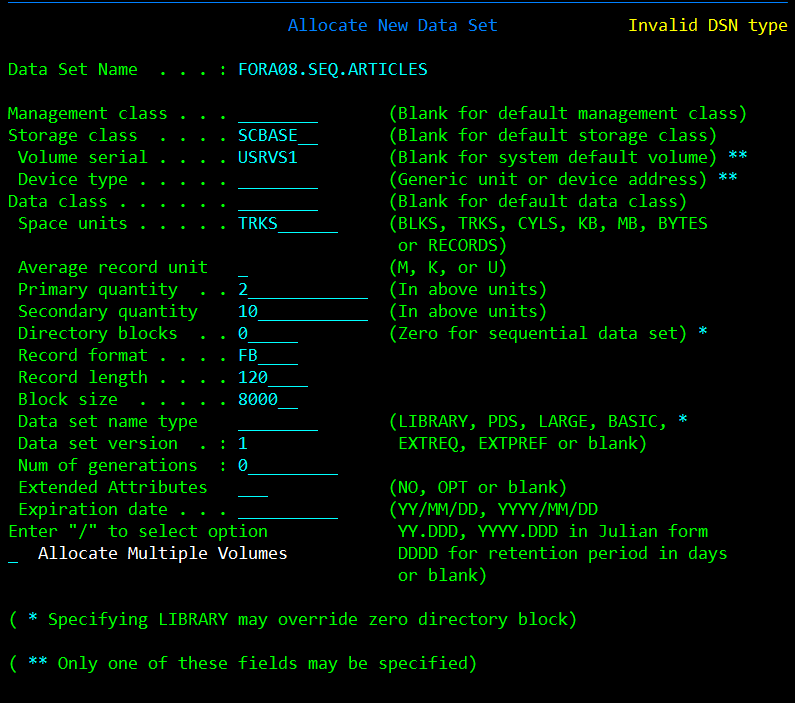

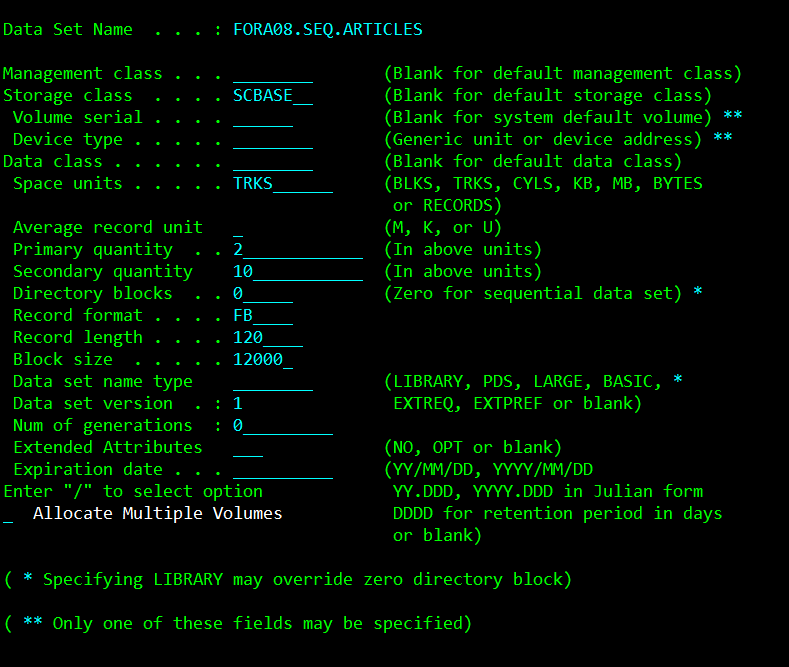

### Vérification des informations du fichier créer


## Accès au menu DSList avec la commande ``3.4``

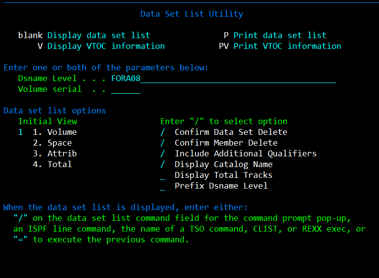


```
E       //Permet d'editer un fichier
```

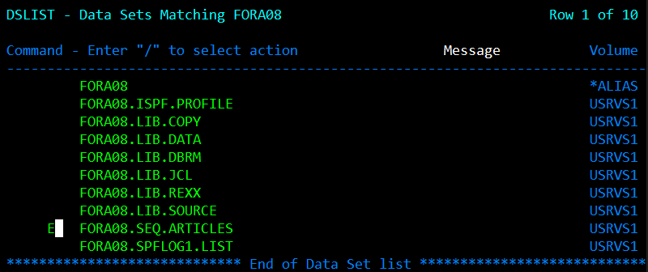

```
I       //Permet d'insert une ligne
```

```
COLS    // permet d'afficher les nombre de collone
```
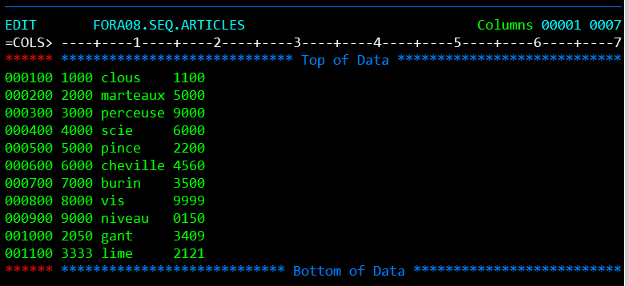

## Créer une bibliothèque pour des ligne de 80 octect, de 5 cylindres et 3 cylindres secondaire

### Accès au menu DSUtility avec la commande ``3.2``

### NAME
```
'FORA08.PGM.COBOL'
```

### Configuration


### Vérification

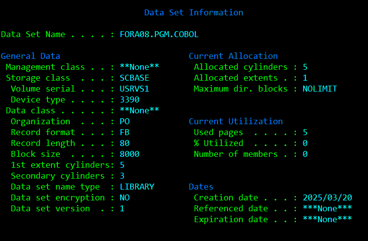

### AJOUT DU PREMEIER MEMBRE GO TO EDIT


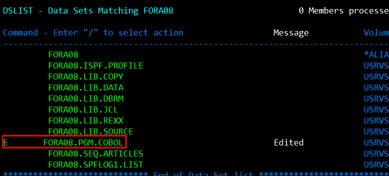

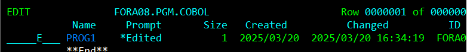

### Ajout d'autre membre

```
S PROG3
```


## Créer un fichier VSAM 

### Accès au menu DSUtility avec la commande ``3.2``

```
V       //Permet de chosire la creation d'un fichier VSAM 
```
### Menu VSAM Utilities 
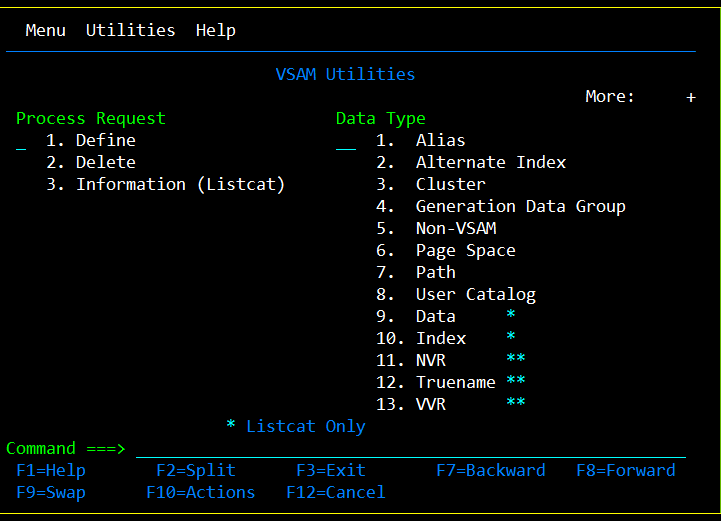

### Choix effectuer
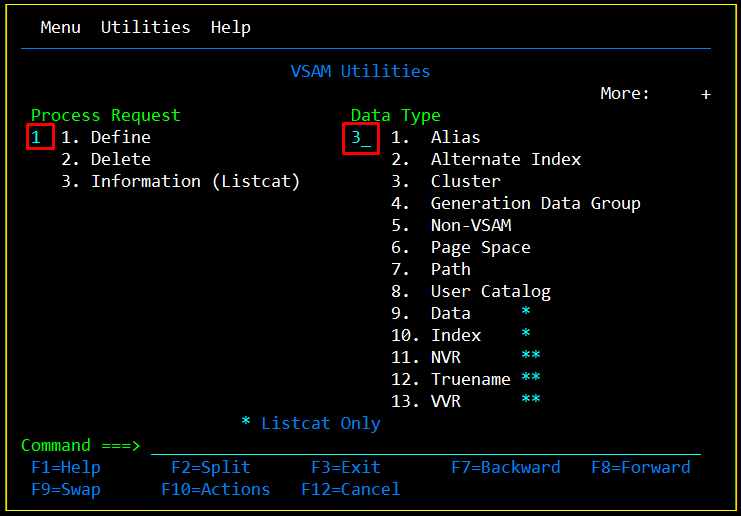

### Configuration

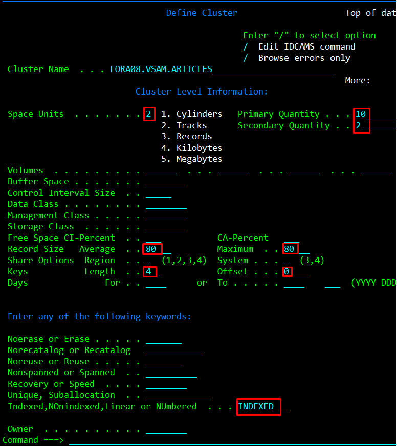

### COMMANDE VSAM Générer

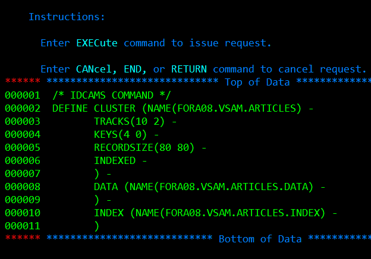

```
EXEcute      //permet d'executer le code generer 
```
### Si le code renvoyer est ``code 0`` le program ces executer sans erreur
 


### Vérification de la création des trois fichier VSAM avec la commande ``3.4``

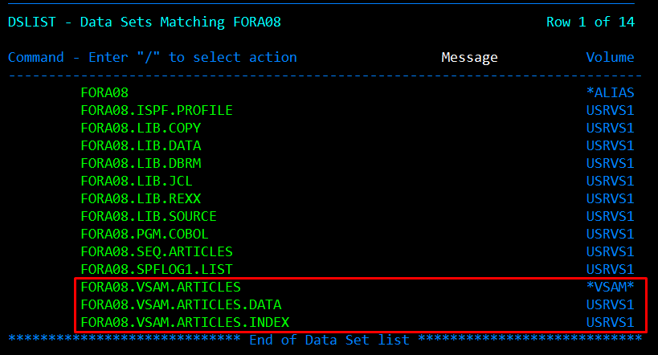
