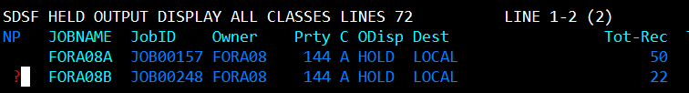

## JCLTEST

```
sub        // Permet d'executer le script JCL
```

### Vérification de l'execution du programme

```
start s    // Permet d'ouvrir le menu SDSF dans un autre onglet
```

```
h          // Permet d'ouvir la liste de OUTPUT effectuer par un JOB
```
### Ouverture de tout les fichiers du JOBNAME de façon concatener

```
s          // Permet d'ouvrir un fichier
```


### Afficher les différent fichier du JOBNAME

```
?
```


### Filtrer la liste de JOB executer sur notre JOBNAME

```
PREFIX FORA08*
```



## TESTERROR


## SORT


### Syntaxe:
````
SORT FIELDS=(starting position, length, data format, A/D)
````

#### starting position

```
1     // Le champ starting position, permet de selectionner la colonne de tri. Dans cette exemple ce sera la colonne 1.
```

#### length

```
4     // Permet de definir la longeur du champ à trier dans la colonne. Dans cette exemple, le champ sera de longueur 4.
```

#### Format des données 

```
CH    // Indique le format du champ comme - Caractère.
```

```
ZD    // Indique le format du champ comme - Décimal zoné signé
```

```
PD    // Indique le format du champ comme - Décimal compacté signé 
      // Exemple pour 8bits : +123 → 12 3C (C = positif)  -123 → 12 3D (D = négatif)
```

```
BI    // Indique le format du champ comme - Binaire non signé
```


#### A/D

```
A     // Permet pour un SORT FIELDS de trier par ordre croissant.
```
```
D     // Permet pour un SORT FIELDS de trier par ordre décroissant.
```


### Test du programe


#### SORTOUT


### Modification de la liste pour effectuer un test decroissant en plus sur les noms.


## ICEMAN 


### LECTURE ET ECRITURE DE MEMBRE EN JCL
```
//SORTIN   DD   DSN=FORA08.LIB.JCL(DONNEES),DISP=SHR 
```
```
//SORTOU   DD   DSN=FORA08.LIB.JCL(TRIE),DISP=SHR 
```

```
OPTION SKIPREC=1      // Permet de skip la premiere ligne, dans le cas où un libeler de tableau serait present en l1
```

### Membre entree ``DONNEE``


### Membre sortie ``TRIES``


### LECTURE ET ECRITURE DE FICHIER EN JCL

```jcl
//FORA08D JOB ACCTFORA,'ALEXANDRE',CLASS=A,MSGCLASS=A,NOTIFY=&SYSUID, 
//         TIME=(,1)                                                  
//SORT     EXEC PGM=ICEMAN                                            
//SORTIN   DD   DSN=FORA08.SEQ.DONNEES,DISP=SHR                       
//SORTOUT  DD   DSN=FORA08.SEQ.TRIES,DISP=SHR                         
//SYSIN    DD   *                                                     
  SORT   FIELDS=(1,4,CH,A)                                            
  OPTION SKIPREC=1                                                    
//SYSOUT   DD   SYSOUT=*                                              
//SYSPRINT DD SYSOUT=*                                                
```


## Effectuer une copie de fichier seq avec IEBGENER 

```JCL
//FORA08C JOB ACCT,'ALEXANDRE',CLASS=A,MSGCLASS=A,NOTIFY=&SYSUID  
//STEP1 EXEC PGM=IEBGENER                                         
//SYSUT1   DD DSN=FORA08.SEQ.DONNEES,DISP=SHR                     
//SYSUT2   DD DSN=FORA08.SEQ.TRIES,DISP=SHR                       
//SYSPRINT DD SYSOUT=*                                            
//SYSOUT   DD SYSOUT=*                                            
//SYSIN    DD DUMMY                                               
```


## Création de membre d'une lib avec les données d'un fichier

```JCL
//FORA08D JOB ACCT,'ALEXANDRE',CLASS=A,MSGCLASS=A,NOTIFY=&SYSUID  
//STEP1 EXEC PGM=IEBGENER                                         
//SYSUT1 DD DSN=FORA08.SEQ.CLIENT,DISP=SHR                        
//SYSUT2 DD DSN=FORA08.LIB.PDF,DISP=SHR                           
//SYSIN DD *                                                      
 GENERATE MAXNAME=3,MAXGPS=2                                      
 MEMBER NAME=MB1                                                  
 RECORD IDENT=(5,'CAEN ',20)                                      
 MEMBER NAME=MB2                                                  
 RECORD IDENT=(5,'SETE ',20)                                      
 MEMBER NAME=MB3                                                  
//SYSPRINT DD SYSOUT=*                                            
```


## IEFBR14 - CREATION ET SUPPRESSION DE FICHIER SEQ & LIB 


```jcl
//FORA08D JOB ACCT,'ALEXANDRE',CLASS=A,MSGCLASS=A,NOTIFY=&SYSUID
//* SUPPRESSION
//STEP1 EXEC PGM=IEFBR14                                       
//TEST1 DD DSN=FORA08.SEQ.VIDE,DISP=(SHR,DELETE,DELETE)
//TEST2 DD DSN=FORA08.LIB.VIDE,DISP=(SHR,DELETE,DELETE)
//* CREATION
//STEP2 EXEC PGM=IEFBR14                                       
//TEST1 DD DSN=FORA08.SEQ.VIDE,DISP=(,CATLG,DELETE),SPACE=(TRK,(2,1)),
//          LRECL=80,BLKSIZE=800,RECFM=FB,DSORG=PS                                    
//TEST2 DD DSN=FORA08.LIB.VIDE,DISP=(,CATLG,DELETE),SPACE=(TRK,(2,1)),
//          LRECL=80,BLKSIZE=800,RECFM=FB,DSORG=PO
//SYSPRINT DD SYSOUT=*
```

## EXERCICE1 - A ECRIRE EN UN SEUL JOB 

1. Créez par jcl un nouveau fichier séquentiel (IEFBR14)  
2. Charger le fichier d'enregistrements non triés (IEBGENER)  
3. Trier le fichier sur lui-même (SORT ou ICEMAN)  
4. Copier le fichier trié dans un nouveau fichier pour une sauvegarde (IEBGENER)  


```jcl
//FORA08D JOB ACCT,'ALEXANDRE',CLASS=A,MSGCLASS=A,NOTIFY=&SYSUID
//         TIME=(,1)
//* CREATION FICHIER SEQ
//STEP1 EXEC PGM=IEFBR14
//EXO1 DD DSN=FORA08.SEQ.IEFBR14,DISP=(,CATLG,DELETE),
//        LIKE=FORA08.SEQ.DONNEES
//SYSPRINT DD SYSOUT=*
//* COPIE DES DONNEES DANS LE FICHIER CREER
//STEP2 EXEC PGM=IEBGENER
//SYSUT1   DD DSN=FORA08.SEQ.DONNEES,DISP=SHR
//SYSUT2   DD DSN=FORA08.SEQ.IEFBR14,DISP=SHR
//SYSPRINT DD SYSOUT=*
//SYSOUT   DD SYSOUT=*
//SYSIN    DD DUMMY
//* TRIE DES DONNEE SUR LUI MEME
//STEP3     EXEC PGM=ICEMAN
//SORTIN   DD   DSN=FORA08.SEQ.IEFBR14,DISP=SHR
//SORTOUT  DD   DSN=FORA08.SEQ.IEFBR14,DISP=SHR
//SYSIN    DD   *
  SORT   FIELDS=(1,4,CH,A)
  OPTION SKIPREC=1
//SYSOUT   DD   SYSOUT=*
//SYSPRINT DD SYSOUT=*
//* COPIES DU FICHIER TRIE EN SAUVEGARDE
//STEP4 EXEC PGM=IEBGENER
//SYSUT1   DD DSN=FORA08.SEQ.IEFBR14,DISP=SHR
//SYSUT2   DD DSN=FORA08.SEQ.SAVE,DISP=(NEW,CATLG,DELETE),
//         LIKE=FORA08.SEQ.IEFBR14
//SYSPRINT DD SYSOUT=*
//SYSOUT   DD SYSOUT=*
//SYSIN    DD DUMMY
```

## Concatenation de deux fichier


```jcl
//FORA08D JOB ACCT,'ALEXANDRE',CLASS=A,MSGCLASS=A,NOTIFY=&SYSUID
//* COPIES DU FICHIER CONCATENER DANS LE FICHIER SEQ.CONCAT
//STEP1 EXEC PGM=IEBGENER
//SYSUT1   DD DSN=FORA08.SEQ.DONNEES,DISP=SHR
//         DD DSN=FORA08.SEQ.DONNEES2,DISP=SHR
//SYSUT2   DD DSN=FORA08.SEQ.CONCAT,DISP=(NEW,CATLG,DELETE),
//         LIKE=FORA08.SEQ.DONNEES
//SYSPRINT DD SYSOUT=*
//SYSOUT   DD SYSOUT=*
//SYSIN    DD DUMMY
```

## GDG de base - GENERATION DATA GROUP

### GDGBASE - CREER LE FICHIER SEQ GDG
```JCL
//FORA08A JOB ACCT,'ALEXANDRE',CLASS=A,MSGCLASS=A,NOTIFY=&SYSUID
//ETAPE1 EXEC PGM=IDCAMS
//SYSIN DD *
 DEFINE GDG(NAME(FORA08.SEQ.CLIENTS) LIMIT(3) SCRATCH)
//SYSPRINT DD SYSOUT=*
```


### GDGGEN - CREER LE VERSIONING DU CLIENT DANS CLIENTS.VERSION
```JCL
//FORA08A JOB ACCT,'ALEXANDRE',CLASS=A,MSGCLASS=A,NOTIFY=&SYSUID 
//ETAPE2 EXEC PGM=IEBGENER                                       
//SYSUT1 DD DSN=FORA08.SEQ.CLIENT,DISP=SHR                       
//SYSUT2 DD DSN=FORA08.SEQ.CLIENTS(+1),DISP=(,CATLG,DELETE),     
// SPACE=(TRK,(1,1)),LRECL=80,BLKSIZE=800,RECFM=FB               
//SYSIN DD DUMMY                                                 
//SYSPRINT DD SYSOUT=*                                                                                 
```


Le fichier ``FORA08.SEQ.CLIENTS.G0001V00`` à était suprimer car on à intiatiliser une limite de version a 3. 


## Procedure cataloger
### EXECPRO
```jcl
//FORA08B JOB ACCTFORA,'ALEXANDRE',CLASS=A,MSGCLASS=A,NOTIFY=&SYSUID,
//        TIME=(,1)                                                  
//TOTO    JCLLIB  ORDER=FORA08.LIB.JCL                               
//STEP2   EXEC MAPROC2                                              
//SYSPRINT DD SYSOUT=*                                               
```

### MAPROC2
```jcl
//MAPROC2 PROC                                               
//* APPELLE LE FICHIER JCL STOCKER                           
//*STEP1    EXEC FORA08LIB.JCL(MAPROC1)                      
//STEP1   EXEC PGM=IDCAMS                                    
//SYSIN DD *                                                 
  DELETE FORA08.SEQ.CLIENT3                                  
  SET MAXCC=0                                                
//STEP2    EXEC PGM=SORT                                     
//SORTIN   DD DSN=FORA08.SEQ.CLIENT,DISP=SHR                 
//SORTOUT  DD DSN=FORA08.SEQ.CLIENT3,DISP=(,CATLG,DELETE),   
//            LRECL=80,BLKSIZE=800,RECFM=FB,SPACE=(TRK,(1,1))
//SYSIN    DD *                                              
  SORT FIELDS=(1,4,CH,A)                                     
//SYSOUT   DD SYSOUT=*                                       
//SYSPRINT DD SYSOUT=*                                       
//         PEND                                              
```

## ICETOOL

```JCL
//FORA08A  JOB CLASS=A,MSGCLASS=A,NOTIFY=&SYSUID,TIME=(,1)      
//EDITION EXEC PGM=ICETOOL                                      
//TOOLMSG   DD SYSOUT=X                                         
//DFSMSG    DD SYSOUT=X                                         
//ENTREE    DD DSN=FORA08.SEQ.CLIENT,DISP=SHR                   
//SORTIE    DD SYSOUT=*                                         
//TOOLIN    DD *                                                
  DISPLAY FROM(ENTREE) -                                        
          LIST(SORTIE) DATE TIME TITLE('GESTION DES CLIENTS') - 
          HEADER('CODE CLIENT')    ON(1,4,CH)-                  
          HEADER('NOM')            ON(6,6,CH) -                 
          HEADER('PRENOM')         ON(13,6,CH) -                
          HEADER('VILLE')          ON(20,6,CH)                  
//SYSOUT    DD SYSOUT=*                                         
//SYSPRINT  DD SYSOUT=*                                         
```


## Procedure cataloger AVEC CONDITION cond

Si le code retour de step1 n'est pas egale à 0 alors on n'execute pas step2.

### EXECPRO

```JCL
//FORA08B JOB ACCTFORA,'ALEXANDRE',CLASS=A,MSGCLASS=A,NOTIFY=&SYSUID,
//        TIME=(,1)                                                  
//TOTO    JCLLIB  ORDER=FORA08.LIB.JCL                               
//STEP2   EXEC MAPROC21                                              
//SYSPRINT DD SYSOUT=*                                               
```

### MAPROC21
```JCL
//MAPROC21 PROC                                              
//STEP1   EXEC PGM=IDCAMS                                    
//SYSIN DD *                                                 
  DELETE FORA08.SEQ.CLIENT3                                  
//* SET MAXCC=0                                              
//STEP2    EXEC PGM=SORT,COND=(0,NE)                         
//SORTIN   DD DSN=FORA08.SEQ.CLIENT,DISP=SHR                 
//SORTOUT  DD DSN=FORA08.SEQ.CLIENT3,DISP=(,CATLG,DELETE),   
//            LRECL=80,BLKSIZE=800,RECFM=FB,SPACE=(TRK,(1,1))
//SYSIN    DD *                                              
  SORT FIELDS=(1,4,CH,A)                                     
//SYSOUT   DD SYSOUT=*                                       
//SYSPRINT DD SYSOUT=*                                       
//         PEND
```
## Procedure cataloger IF/THEN

Si le code retour de step1 n'est pas egale à 0 alors on n'execute pas ce qu'il y en entre le ``IF`` et le ``ENDIF``.

### EXECPRO

```JCL
//FORA08B JOB ACCTFORA,'ALEXANDRE',CLASS=A,MSGCLASS=A,NOTIFY=&SYSUID,
//        TIME=(,1)                                                  
//TOTO    JCLLIB  ORDER=FORA08.LIB.JCL                               
//STEP2   EXEC MAPROC22                                              
//SYSPRINT DD SYSOUT=*                                               
```

### MAPROC22
```JCL
//MAPROC22 PROC                                              
//STEP1   EXEC PGM=IDCAMS                                    
//SYSIN DD *                                                 
  DELETE FORA08.SEQ.CLIENT5                                  
//* SET MAXCC=0                                              
//COND01   IF STEP1.RC=0 THEN                                
//STEP2    EXEC PGM=SORT                                     
//SORTIN   DD DSN=FORA08.SEQ.CLIENT,DISP=SHR                 
//SORTOUT  DD DSN=FORA08.SEQ.CLIENT3,DISP=(,CATLG,DELETE),   
//            LRECL=80,BLKSIZE=800,RECFM=FB,SPACE=(TRK,(1,1))
//SYSIN    DD *                                              
  SORT FIELDS=(1,4,CH,A)                                     
//SYSOUT   DD SYSOUT=*                                       
//SYSPRINT DD SYSOUT=*                                       
//         ENDIF                                             
//         PEND                                              
```

## VARIABLE DE SUBSTITUTION

Permet de placer des variable en paramettre d'un fichier JCL via des variable substitution au moment de l'execution.

### EXECPRO3
```JCL
//FORA08C JOB ACCTFORA,'ALEXANDRE',CLASS=A,MSGCLASS=A,NOTIFY=&SYSUID,
//        TIME=(,1)                                                  
//D1    JCLLIB  ORDER=FORA08.LIB.JCL                                 
//STEP1   EXEC PROC=MAPROC3,FICHIER1=FORA08.SEQ.CLIENT,           
//             FICHIER1=FORA08.SEQ.CLIENT,R=FB                       
//SYSPRINT DD SYSOUT=*                                                                                             
```

### MAPROC3
```JCL
//MAPROC3 PROC                                              
//STEP1   EXEC PGM=IDCAMS                                    
//SYSIN DD *                                                 
  DELETE FORA08.SEQ.CLIENT5                                  
//* SET MAXCC=0                                              
//COND01   IF STEP1.RC=0 THEN                                
//STEP2    EXEC PGM=SORT                                     
//SORTIN   DD DSN=&FICHIER1,DISP=SHR                 
//SORTOUT  DD DSN=&FICHIER2,DISP=(,CATLG,DELETE),   
//            LRECL=80,BLKSIZE=800,RECFM=&R,SPACE=(TRK,(1,1))
//SYSIN    DD *                                              
  SORT FIELDS=(1,4,CH,A)                                     
//SYSOUT   DD SYSOUT=*                                       
//SYSPRINT DD SYSOUT=*                                       
//         ENDIF                                             
//         PEND                                              
```
