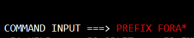

 Date | Sujet
:---|:---
 19/03/2025 | Gestion des données


## Premier pas sur z/OS x370

### ``Utilitie`` > ``Library`` est accesible directement avec la commande `3.1`


### Puis `DA` pour lister l'activiter des utilisateur


### Application d'un filtre pour la liste d'activiter par ``Job name`` commencent par ``FORA`` 
```
PREFIX FORA*
```

### Pour ``CANCEL`` une activiter ecrire ``C``dans la colonne ``NP``


 Menu initial > F3 > 2 > ``LOGOFF`` pour une déconnexion

### ``I`` permet de voir les programe en file d'attente.


## Programme Cobol

````c
profile          //permet d'afficher le profile du fichier cobol
````

```c
AUTOSAVE ON      //permet d'activer la sauvegarde auto sur le fichier
```

```c
HILITE COBOL     //permet une lecture du code en style COBOL
```

```c
Undo             //permet de restauré les dernières modification
```



