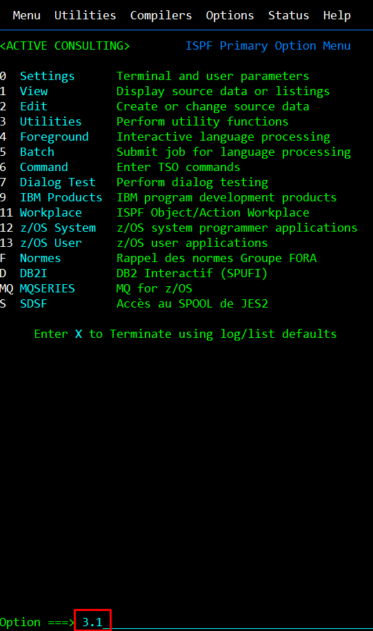
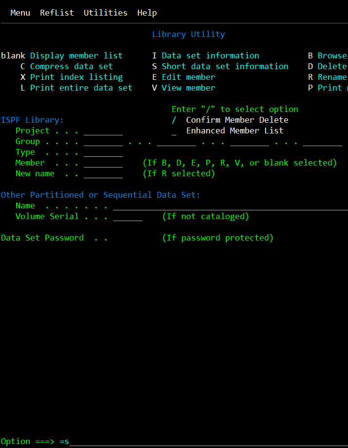
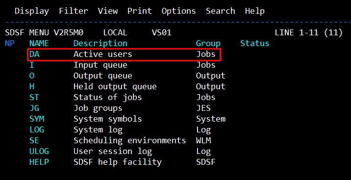
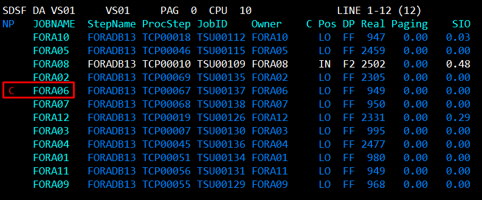
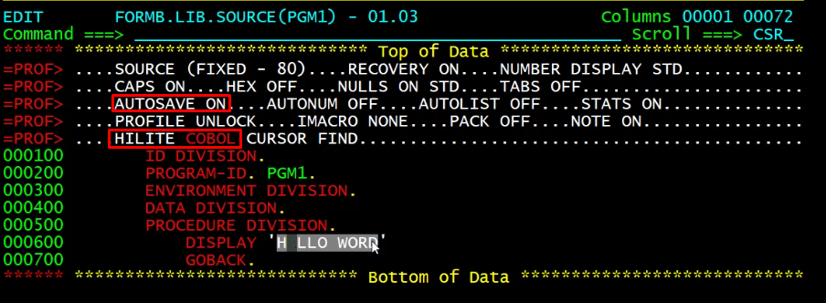

 Date | Sujet
:---|:---
 19/03/2025 | Gestion des données


## Premier pas sur z/OS x370

### ``Utilitie`` > ``Library`` est accesible directement avec la commande `3.1`




### ``I`` permet de voir les programe en file d'attente

### `DA` permet de lister l'activiter des utilisateurs



#### Application d'un filtre pour la liste d'activiter  par ``Job name`` commencent par ``FORA`` 
```
PREFIX FORA*
```

#### Pour ``CANCEL`` une activiter ecrire ``C``dans la colonne ``NP``



###  Déconexion du z/OS x370
Menu initial > F3 > 2 > ``LOGOFF`` pour une déconnexion.


## Cobol - Hello World

```
profile          //permet d'afficher le profile du fichier cobol
```

```
AUTOSAVE ON      //permet d'activer la sauvegarde auto sur le fichier
```

```
HILITE COBOL     //permet une lecture du code en style COBOL
```

```
Undo             //permet de restauré les dernières modification
```



