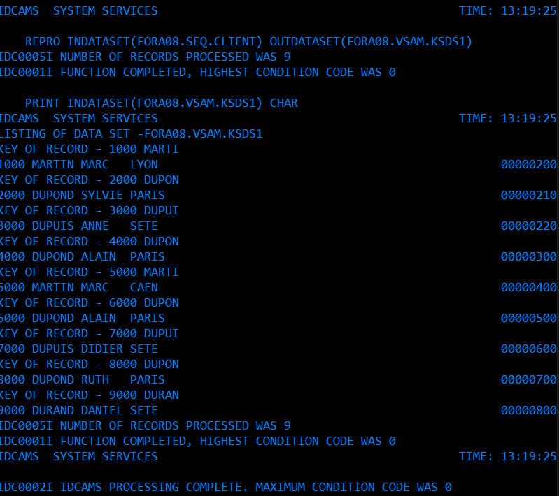

# Exercice VSAM

## CREATION ET SUPPRESSION DE ``CLUSTER VSAM``

```jcl
//FORA08D  JOB ACCT,'ALEXANDRE',CLASS=A,MSGCLASS=A,NOTIFY=&SYSUID
//STEP1 EXEC PGM=IDCAMS
//SYSPRINT DD SYSOUT=*
//SYSIN    DD *
 DEFINE CLUSTER (NAME(FORA08.VSAM.KSDS1) -
         INDEXED - 
         TRACKS(2 1) -
         RECORDSIZE(80 80) -
         KEYS(4 0))
  DELETE FORA08.VSAM.ESDS1
  SET MAXCC=0
  DEFINE CLUSTER (NAME(FORA08.VSAM.ESDS1) -
         NONINDEXED -
         TRACKS(2 1) -
         RECORDSIZE(80 80))
/*
```


### LISTCAT ENTRIES

AJOUT DE ```LISTCAT ENTRIES(FORA08.VSAM.ESDS1) ALL``` POUR LIRE LES PARAMETRE DU FICHIER VSAM ET LE RETOURNER DANS LE RESULTAT ``SYSPRINT`` DU JOB EN ``SDSF``.

```JCL
//FORA08D  JOB ACCT,'ALEXANDRE',CLASS=A,MSGCLASS=A,NOTIFY=&SYSUID
//STEP1 EXEC PGM=IDCAMS
//SYSPRINT DD SYSOUT=*                                       
//SYSIN    DD *
  DELETE FORA08.VSAM.KSDS1
  SET MAXCC=0
  DEFINE CLUSTER (NAME(FORA08.VSAM.KSDS1) -                      
         INDEXED -                                               
         TRACKS(2 1) -                                           
         RECORDSIZE(80 80) -                                     
         KEYS(4 0))   
  LISTCAT ENTRIES(FORA08.VSAM.KSDS1) ALL
  DELETE FORA08.VSAM.ESDS1 
  SET MAXCC=0                    
  DEFINE CLUSTER (NAME(FORA08.VSAM.ESDS1) -                      
         NONINDEXED -                                            
         TRACKS(2 1) -                                           
         RECORDSIZE(80 80))  
  LISTCAT ENTRIES(FORA08.VSAM.ESDS1) ALL
/*                               
```

## Copie des données du fichier ``sequentiel`` dans un fichier ``VSAM``

ON PEUT AUSSI REMPLACER ``INDATASET`` PAR ``IDS`` ET ``OUTDATASET`` PAR ``ODS``.

```jcl
//FORA08D  JOB ACCT,'ALEXANDRE',CLASS=A,MSGCLASS=A,NOTIFY=&SYSUID
//STEP1 EXEC PGM=IDCAMS
//SYSIN    DD *
    REPRO INDATASET(FORA08.SEQ.CLIENT) OUTDATASET(FORA08.VSAM.KSDS1)
    PRINT INDATASET(FORA08.VSAM.KSDS1) CHAR
//SYSPRINT DD SYSOUT=*
```



### POUR PRINT HEX AU LIEU DE CHAR

```
PRINT INDATASET(FORA08.VSAM.KSDS1) HEX
```

 

## ALTERNATE INDEX - AIX

 

 ```JCL
//FORA08D JOB ACCT,'ALEXANDRE',CLASS=A,MSGCLASS=A,NOTIFY=&SYSUID
//STEP1 EXEC PGM=IDCAMS
//SYSPRINT DD SYSOUT=*
//SYSIN    DD *
  DELETE FORA08.VSAM.KSDS1
  SET MAXCC=0
  DEFINE CLUSTER (NAME(FORA08.VSAM.KSDS1) -
         INDEXED -
         TRACKS(2 1) -
         RECORDSIZE(80 80) -
         KEYS(4 0) -
         CISZ(4096))
  DELETE FORA08.VSAM.ESDS1
  SET MAXCC=0
  DEFINE CLUSTER (NAME(FORA08.VSAM.ESDS1) -
         NONINDEXED -
         TRACKS(6 1) -
         RECORDSIZE(80 80) -
         CISZ(4096))
  REPRO INDATASET(FORA08.SEQ.CLIENT) OUTDATASET(FORA08.VSAM.KSDS1)
  DEFINE ALTERNATEINDEX(NAME(FORA08.VSAM.KSDS1.AIX) -
         RELATE(FORA08.VSAM.KSDS1) -
         TRACKS(1 1) -
         KEYS(6 5) -
         RECORDSIZE(80 80))
  BLDINDEX INDATASET(FORA08.VSAM.KSDS1) -
  OUTDATASET(FORA08.VSAM.KSDS1.AIX)
  PRINT INDATASET(FORA08.VSAM.KSDS1.AIX) CHAR
/*
 ```

 

 ## DEFINE A PATH : PATHENTRY


 ```JCL
//FORA08D JOB ACCT,'ALEXANDRE',CLASS=A,MSGCLASS=A,NOTIFY=&SYSUID
//STEP1 EXEC PGM=IDCAMS
//SYSPRINT DD SYSOUT=*
//SYSIN    DD *
  DELETE FORA08.VSAM.KSDS1
  SET MAXCC=0
  DEFINE CLUSTER (NAME(FORA08.VSAM.KSDS1) -
         INDEXED -
         TRACKS(2 1) -
         RECORDSIZE(80 80) -
         KEYS(4 0) -
         CISZ(4096))
  DELETE FORA08.VSAM.ESDS1
  SET MAXCC=0
  DEFINE CLUSTER (NAME(FORA08.VSAM.ESDS1) -
         NONINDEXED -
         TRACKS(6 1) -
         RECORDSIZE(80 80) -
         CISZ(4096))
  REPRO INDATASET(FORA08.SEQ.CLIENT) OUTDATASET(FORA08.VSAM.KSDS1)
  DEFINE ALTERNATEINDEX(NAME(FORA08.VSAM.KSDS1.AIX) -
         RELATE(FORA08.VSAM.KSDS1) -
         TRACKS(1 1) -
         KEYS(6 5) -
         RECORDSIZE(80 80))
  DEFINE PATH (NAME(FORA08.VSAM.KSDS1.PATH) -
         PATHENTRY(FORA08.VSAM.KSDS1.AIX))
  BLDINDEX INDATASET(FORA08.VSAM.KSDS1) -
  OUTDATASET(FORA08.VSAM.KSDS1.AIX)
  PRINT INDATASET(FORA08.VSAM.KSDS1.PATH) CHAR
/*
 ```

 
